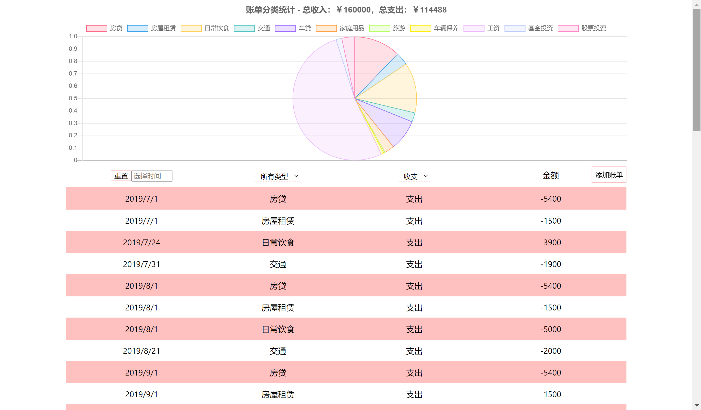

This project was bootstrapped with [Create React App](https://github.com/facebook/create-react-app).

## 如何运行本项目

1. 克隆该项目到任意文件夹：`git clone https://github.com/rockhamx/xSolution.git`
2. 前往后端文件夹`cd ./backend`，安装依赖：`yarn`，运行后端服务器：`yarn start` 
3. 前往前端文件夹`cd ./frontend`，安装依赖：`yarn`，运行前端服务器：`yarn start` 
4. 等待create-react-app自动打开网页，或者在浏览器访问：`localhost:3000`

## 功能简介

1. 账单展示。
2. 账单筛选。包括时间、分类、收支类型三种筛选方式。
3. 添加账单。
4. 分类统计。数据可视化基于[chart.js](https://www.chartjs.org/)
5. 响应式设计(不完美)

## 预览

